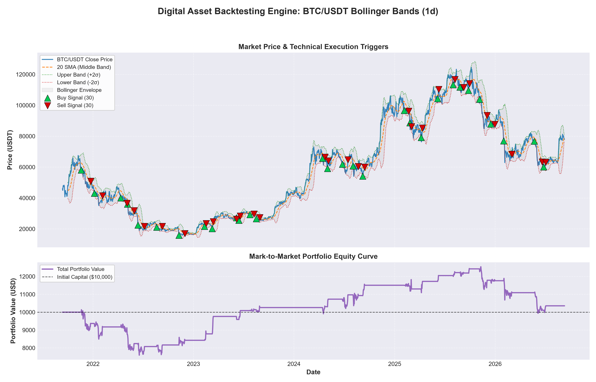
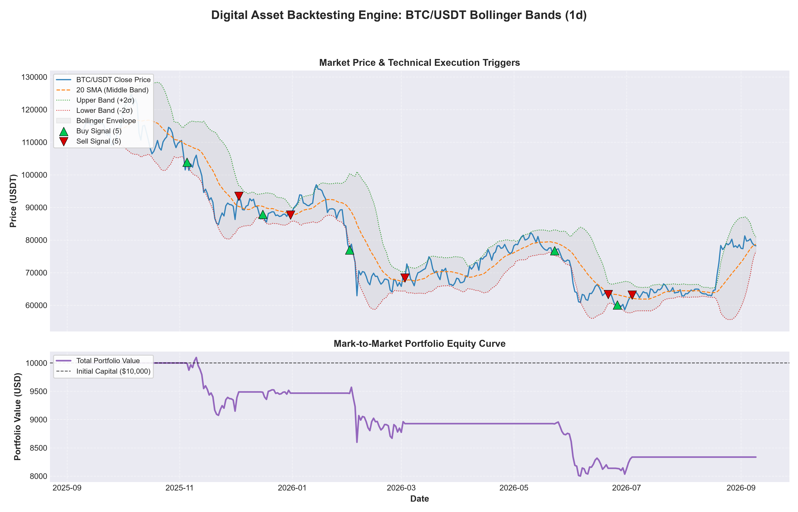

# Modular Quantitative Backtesting Engine

[](https://github.com/dbl04/digital-asset-backtester/actions)


## Overview
An event-driven backtesting framework built in Python for designing, simulating, and analyzing quantitative trading strategies in digital asset markets. This engine is designed with a strict focus on preventing data leakage and modeling realistic market execution environments.

## Core Features
*   **Event-Driven Architecture:** Replaces vectorized simulation with a sequential, day-by-day event loop to strictly prevent look-ahead bias and simulate real-time decision-making.
*   **Realistic Market Friction:** Incorporates customizable exchange taker fees (default `0.10%`) applied to every state transition (buy/sell) to prevent inflated, zero-fee theoretical returns.
*   **Dynamic Position Sizing:** Includes risk-management scaling. The default configuration uses a fixed-fractional sizing model (allocating 50% of available cash per signal) to mitigate drawdown severity and prevent total capital ruin.
*   **Automated Data Pipeline:** Integrates with the `ccxt` library to fetch historical OHLCV data directly from exchange REST APIs (Binance), featuring local CSV caching to optimize bandwidth and respect rate limits.

## Default Strategy Implementation
The framework comes pre-configured with a statistical mean-reversion strategy utilizing **Bollinger Bands**:
*   **Mathematical Logic:** Calculates a 20-period Simple Moving Average (SMA) and a 2-period standard deviation. 
*   **Signal Triggers:** Executes long positions when the asset price drops below the lower band (statistically oversold) and liquidates the position when the price reverts to the mean (SMA).

## Performance Visualizations & Key Metrics

The framework includes a built-in `matplotlib` reporting suite that generates dual-pane charts mapping execution triggers (buy/sell) directly against the portfolio's mark-to-market equity curve.

| Metric | 1-Year Horizon (2025–2026) | 5-Year Horizon (2021–2026) |
| :--- | :---: | :---: |
| **Strategy Cumulative Return** | **-16.64%** | **+3.56%** |
| **Benchmark (BTC Buy & Hold) Return** | -31.58% | +69.41% |
| **Strategy Max Drawdown (MDD)** | **-20.76%** | **-25.08%** |
| **Benchmark Max Drawdown (MDD)** | -52.97% | -76.63% |
| **Annualized Sharpe Ratio** | -1.22 | 0.12 |
| **Execution Friction** | 0.10% Taker Fee | 0.10% Taker Fee |




## Quick Start Configuration

### 1. Installation
Clone the repository and install the required dependencies:
```bash
git clone https://github.com/dbl04/digital-asset-backtester.git
cd digital-asset-backtester
python -m venv venv
source venv/bin/activate  # On Windows use: venv\Scripts\activate
pip install -r requirements.txt
```

### 2. Running the Main Backtest Engine
Execute the end-to-end backtesting pipeline, data loader, strategy generator, and visual dashboard renderer:
```bash
python main.py
```

### 3. Running Unit Tests & Coverage
Execute the comprehensive `pytest` suite to verify signal generation, look-ahead bias prevention, trade accounting, and metrics accuracy:
```bash
pytest --cov=src --cov-report=term-missing
```

## Automated CI/CD Pipeline
This repository includes a **GitHub Actions** Continuous Integration workflow (`.github/workflows/ci.yml`). On every `git push` or `pull_request` to `main`, GitHub automatically builds the environment across Python versions (3.10, 3.11, 3.12), installs dependencies, and runs the entire test suite to guarantee code reliability and prevent regression bugs.
